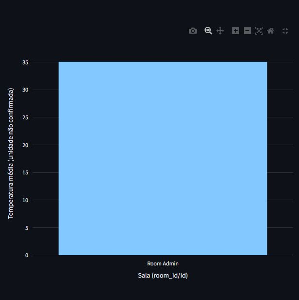
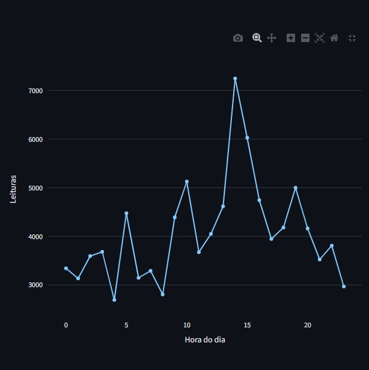
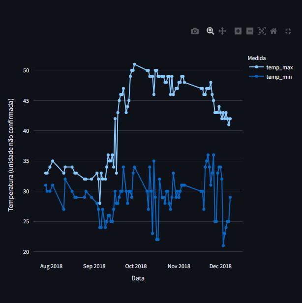

# Pipeline de Dados com IoT e Docker

Relatório acadêmico

**Aluna:** Nicoly [preencher nome completo]

**Matrícula ou RM:** [preencher]

**Instituição:** [preencher]

**Curso e turma:** [preencher]

**Disciplina:** Disruptive Architectures: IoT, Big Data e IA

**Professor ou professora:** [preencher]

**Local e data de entrega:** [preencher]

Repositório na branch develop:
https://github.com/nicolyfreitasoliveira/-disruptive_architectures/tree/develop

---

## 1 Introdução e objetivos

Sensores IoT geram medições que precisam ser organizadas para consulta e análise. Registros dispersos dificultam a comparação temporal e a reprodução de resultados. Este projeto transforma um CSV histórico real em registros estruturados no PostgreSQL e visualizações interativas no Streamlit.

A fonte é Temperature Readings: IoT Devices, de Atul Anand Jha, no Kaggle. O arquivo IOT-temp.csv contém 97.606 registros associados à sala Room Admin e aos ambientes In e Out. A solução mantém os valores originais, inclusive uma linha duplicada, sem imputação ou remoção de observações para melhorar os gráficos.

O objetivo geral é integrar processamento em Python, banco em Docker e visualização interativa. Os objetivos específicos são validar o arquivo, inserir as leituras em uma transação, impedir reimportação idêntica, construir três views SQL, apresentar os gráficos exigidos e verificar fidelidade por auditoria independente.

### Tecnologias

- Python e pandas: leitura em lotes, validação e normalização.
- SQLAlchemy e psycopg2-binary: conexão e comandos transacionais.
- PostgreSQL 16: armazenamento, integridade e agregações SQL.
- Docker Compose: definição do serviço, volume e healthcheck.
- Streamlit e Plotly: interface e gráficos interativos.
- pytest: testes de processamento, interface e integração.
- Git e GitHub: versionamento e disponibilização do código.

O escopo é processamento histórico em lote. Não há coleta ao vivo nem treinamento de modelo de IA.

---

## 2 Arquitetura e ambiente

Fluxo: CSV original → pandas → SQLAlchemy → PostgreSQL → views SQL → Streamlit e Plotly. O arquivo e o histórico de importação permitem rastrear a origem de cada registro.

O código fica em src/, o SQL em sql/, a base local em data/ e a documentação em docs/. dashboard.py inicia a interface. requirements.txt declara dependências e requirements-lock.txt registra as versões do ambiente testado com Python 3.14. Para outras versões compatíveis, requirements-dev.txt permite resolver as dependências.

Um ambiente virtual .venv isola a instalação. .env.example é o modelo para .env, com credenciais e CSV_PATH. Credenciais e ambiente virtual não são enviados ao GitHub.

```powershell
python -m venv .venv
.\.venv\Scripts\python.exe -m pip install -r requirements-dev.txt
if (!(Test-Path .env)) { Copy-Item .env.example .env }
docker compose up -d --wait
.\.venv\Scripts\python.exe -m src.pipeline
.\.venv\Scripts\python.exe -m src.verify
.\.venv\Scripts\python.exe -m streamlit run dashboard.py
```

O Compose define postgres:16-alpine, porta acessível apenas em localhost, volume postgres_data e healthcheck com pg_isready. Configura-se a senha no .env antes da inicialização. docker compose down interrompe o serviço sem apagar o volume.

O banco validado respondeu como PostgreSQL 16.15 em Linux Alpine. A conexão e as consultas funcionaram. O terminal não disponibilizou o executável Docker nesta etapa; a execução dos comandos Compose não foi repetida pelo agente. A auditoria foi realizada no PostgreSQL em funcionamento.

---

## 3 Processamento e armazenamento

O arquivo possui cinco colunas: id é preservado como source_id, identificador da leitura; room_id/id vira device_id por compatibilidade com o enunciado; noted_date vira recorded_at; temp vira temperature; out/in vira location. device_id representa uma sala, não um sensor físico individual.

Datas são interpretadas explicitamente como dia-mês-ano hora:minuto, sem conversão de fuso. Temperaturas devem ser números finitos, e os campos obrigatórios precisam ser válidos. Erros interrompem a carga, sem substituição artificial de valores.

O pipeline lê lotes de 10.000 linhas por padrão. Uma transação evita importações parciais. O SHA-256 impede reimportar conteúdo idêntico. Arquivos diferentes não são deduplicados entre si; sobreposição deve ser revisada antes de novas cargas.

ingestion_runs registra arquivo, hash único, quantidade e horário. temperature_readings guarda origem, número da linha, identificador original, sala, data, temperatura e ambiente. Há chave estrangeira, unicidade por importação e linha, e índices por data e identificador.

No banco auditado existe uma importação de 97.606 registros. Todas as linhas e campos foram comparados com o CSV, em ordem, por um parser independente da função de processamento. O hash é:

```text
2bf965701db96cd5788403d395a25d2dd7282bea24e317b7f7b157b7a02063d4
```

A evidência está em docs/auditoria-postgresql.json. python -m src.audit_database reproduz a comparação sem modificar o banco. python -m src.verify confere conexão, histórico, contagens e consultas das três views.

---

## 4 Views SQL e finalidades

Views são consultas nomeadas que oferecem uma interface consistente para o dashboard. As definições ficam em sql/views.sql e são criadas junto das tabelas.

### Média por identificador de sala

avg_temp_por_dispositivo calcula média e quantidade por device_id. Há somente Room Admin; a média reúne In e Out. Seu propósito é resumir o identificador disponível, sem presumir um sensor físico.

```sql
SELECT device_id, AVG(temperature) AS avg_temp, COUNT(*) AS contagem
FROM temperature_readings GROUP BY device_id;
```

### Leituras por hora do dia

leituras_por_hora conta registros pela hora de recorded_at em todo o período. Mostra distribuição entre 0h e 23h; não é uma sequência cronológica de intervalos consecutivos.

```sql
SELECT EXTRACT(HOUR FROM recorded_at)::INTEGER AS hora,
       COUNT(*) AS contagem
FROM temperature_readings GROUP BY hora;
```

### Extremos por dia

temp_max_min_por_dia calcula máximo e mínimo por data, reunindo os ambientes. Apoia a investigação de amplitude diária, sem preencher datas ausentes ou atribuir causas.

```sql
SELECT recorded_at::DATE AS data, MAX(temperature) AS temp_max,
       MIN(temperature) AS temp_min
FROM temperature_readings GROUP BY recorded_at::DATE;
```

Todas as linhas das três views coincidiram com agregações independentes do CSV. Contagens e extremos foram iguais exatamente; médias coincidiram dentro da tolerância numérica de 1e-12.

---

## 5 Dashboard e média por sala

O Streamlit consulta exclusivamente as views PostgreSQL. Mostra quantidade de registros, identificadores da fonte, dias com leituras e exportações CSV. O cache dura 60 segundos e pode ser atualizado por botão. Banco vazio ou indisponível gera orientação.

O gráfico exigido como média por dispositivo usa room_id/id. A única barra corresponde a Room Admin, com média 35,05393111079237 na escala original, somando In e Out. O eixo informa unidade não confirmada. Uma média global não permite concluir que um sensor específico manteve esse valor durante todo o período.



---

## 6 Leituras por hora do dia

A linha reúne o volume registrado em cada hora do dia durante todo o período. As 24 horas têm registros, somando 97.606. O maior volume ocorreu às 14h, com 7.248 leituras; o menor às 4h, com 2.690.



A desigualdade de volume pode orientar investigação da cobertura de aquisição. Não comprova causa, regularidade da amostragem ou funcionamento contínuo. Os horários da fonte foram preservados.

---

## 7 Máximas e mínimas diárias

As duas linhas mostram os extremos por data, reunindo In e Out. Existem 86 datas com registros. Os marcadores representam observações; segmentos entre pontos não acrescentam medições nas datas ausentes.



O mínimo global é 21 e o máximo global é 51, na escala original. A maior amplitude diária é 28 em 16/10/2018. Os extremos podem refletir ambientes diferentes e não diagnosticam, isoladamente, defeito de sensor ou causa da variação.

---

## 8 Resultados e limitações

A auditoria confirmou 97.606 registros no CSV e no banco. Há 97.605 IDs distintos e uma linha integralmente duplicada, mantida para preservar a fonte. Não se confundem quantidade de registros e quantidade de IDs únicos.

Room Admin é o único identificador de sala. São 77.261 registros Out e 20.345 In. Não existe identificador individual de sensor físico. O período vai de 28/07/2018 07:06 a 08/12/2018 09:30: 134 dias corridos inclusivos, com leituras em 86 datas e 48 sem registros.

A média global é 35,0539, mínimo 21 e máximo 51. O pico de volume às 14h e a maior amplitude de 28 em 16/10/2018 são observações verificadas, sem atribuição causal. As agregações reúnem os ambientes; não sustentam comparações entre sensores físicos.

O CSV não indica unidade de temp e a documentação primária acessível não confirmou graus Celsius ou Fahrenheit. Nenhuma conversão foi aplicada. O fuso também não foi especificado. Comparações com limites físicos externos exigem confirmação desses metadados.

### Aplicações práticas

O pipeline pode apoiar acompanhamento ambiental, revisão de cobertura temporal e investigação de extremos. Em operação real, seria necessário identificar sensores, unidade, fuso, localização e calibração antes de definir alertas ou decisões.

### Conclusão

A aplicação atende à integração de Python, PostgreSQL, Docker e Streamlit. A auditoria comprova a preservação dos dados e a consistência das três views. Os resultados descrevem o histórico, respeitando limitações de unidade, identificação e amostragem. Melhorias futuras podem priorizar qualidade da aquisição e metadados, sem alterar retroativamente as observações.

---

## 9 Validação e referências

Foram executadas auditoria integral, verificação do banco e reexecução do pipeline. O hash reconheceu o arquivo já importado sem duplicação. Os 12 testes finais passaram, sem testes ignorados, com integração em um banco temporário separado e removido ao final. pip check não encontrou incompatibilidades. Os três gráficos foram observados no navegador e as capturas são dessa execução real. Os resultados completos constam em docs/validacao.md.

O roteiro em docs/roteiro-video.md dura aproximadamente 3min50s. Preenchimento da identificação acadêmica, gravação e publicação do vídeo são realizados pela aluna. O código é entregue na branch develop, sem necessidade de merge na main.

### Referências

1. Enunciado da atividade Pipeline de Dados com IoT e Docker, fornecido pelo professor, sete páginas.

2. Atul Anand Jha. Temperature Readings: IoT Devices. Kaggle. Acesso em 07/10/2026.
https://www.kaggle.com/datasets/atulanandjha/temperature-readings-iot-devices

3. Docker. Documentação do Docker Compose. Acesso em 07/10/2026.
https://docs.docker.com/compose/

4. PostgreSQL Global Development Group. PostgreSQL 16, Views. Acesso em 07/10/2026.
https://www.postgresql.org/docs/16/tutorial-views.html

5. SQLAlchemy. Unified Tutorial. Acesso em 07/10/2026.
https://docs.sqlalchemy.org/en/20/tutorial/

6. Streamlit. Documentação. Acesso em 07/10/2026.
https://docs.streamlit.io/

7. Plotly. Gráficos Python. Acesso em 07/10/2026.
https://plotly.com/python/

8. pandas. Documentação. Acesso em 07/10/2026.
https://pandas.pydata.org/docs/
